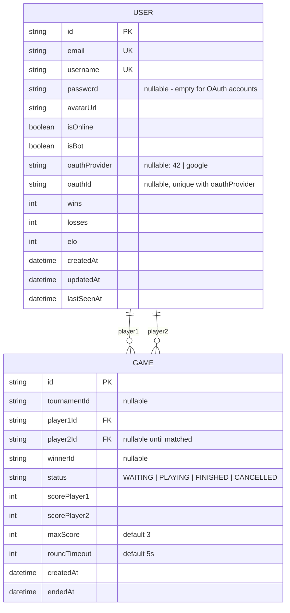

*This project has been created as part of the 42 curriculum by ylouvel, fcaval, hguesne, bbeaurai.*

# Transcendance PFC — Pierre-Feuille-Ciseaux Online

## Description

**Transcendance PFC** is a real-time, multiplayer **Rock-Paper-Scissors (Pierre-Feuille-Ciseaux)** web platform built for the 42 `ft_transcendence` project. Instead of the classic Pong game, the team chose to build a competitive best-of-N Rock-Paper-Scissors arena with matchmaking, an ELO ranking system, and an AI opponent.

Key features:
- Secure account creation and login (email/password), plus **OAuth 2.0** login with **42** and **Google**.
- **Play vs AI**: a bot that reads the opponent's last round and adapts its move, instead of playing purely at random.
- **Play vs a remote player**: live 1v1 matches over WebSockets, with matchmaking, reconnection handling, and a synchronized round timer.
- A random bonus mini-event during a match — **"le puits" (the well)** — a short reflex window either player can hit to win the round outright.
- Live **ELO rating**, win/loss tracking, and a profile page.
- Full **internationalization**: French, English and Spanish, switchable at any time from the header.
- Accessible **Privacy Policy**, **Terms of Service**, **Instructions** and **AI usage** pages, linked from the footer.
- Fully **containerized** deployment (Docker Compose) behind a **Caddy** reverse proxy serving HTTPS, with an optional `ngrok` tunnel for playing with remote friends outside the local network.

## Instructions

### Prerequisites

- **Docker** and **Docker Compose**
- **Node.js 24** (the provided `makefile` installs and switches to it automatically via `nvm` if it's missing)
- A `.env` file at the project root (see `.env.exemple` for the required keys: database credentials, `JWT_SECRET`, 42 and Google OAuth client credentials/redirect URIs, and — only if you want remote play via tunnel — `NGROK_AUTHTOKEN` / `NGROK_URL`)
- Self-signed TLS certificates in `certs/` for local HTTPS (already provided for local development; replace them with your own if needed)

### Running the project

All commands are run from the project root via the `makefile`:

```bash
# Build and start the database, backend and frontend containers,
# reverse-proxied by Caddy, then apply Prisma migrations
make server
```

The app is then reachable at **https://localhost:8443** (accept the self-signed certificate warning in your browser).

```bash
# Optional: expose the local app publicly through ngrok, so a
# remote friend can join a match over the internet
make tunnel

# Open the Prisma Studio database browser
make npx
# then
make db

# Stop everything (containers + Prisma Studio)
make stop
```

### First run checklist

1. Copy `.env.exemple` to `.env` and fill in the values (Postgres credentials, `JWT_SECRET`, OAuth credentials for 42 and Google, etc.).
2. Run `make server`. This installs dependencies, starts PostgreSQL + the backend + the frontend + Caddy via Docker Compose, and runs `npx prisma migrate dev` against the database.
3. Open **https://localhost:8443**, register an account (or log in with 42 / Google), and play from the Menu.

## Resources

### Documentation used

- [React](https://react.dev/) & [React Router](https://reactrouter.com/)
- [Express](https://expressjs.com/)
- [Prisma ORM](https://www.prisma.io/docs)
- [Socket.IO](https://socket.io/docs/v4/)
- [42 API OAuth documentation](https://api.intra.42.fr/apidoc/guides/getting_started)
- [Google OAuth 2.0 documentation](https://developers.google.com/identity/protocols/oauth2)
- [jsonwebtoken](https://github.com/auth0/node-jsonwebtoken) / [bcrypt](https://www.npmjs.com/package/bcrypt)
- [Tailwind CSS](https://tailwindcss.com/docs)
- [react-i18next](https://react.i18next.com/)
- [Docker Compose](https://docs.docker.com/compose/) & [Caddy](https://caddyserver.com/docs/)

### AI usage

- **GitHub Copilot** (coding agent) was used once during development to remove dead code and clean up leftover comments across the frontend (see commit *"Remove dead code and clean app comments"*).
- **Claude (Anthropic, Claude Code)** was used to read through the finished codebase (backend, frontend, Prisma schema, Docker/Caddy setup, git history) and draft this `README.md` according to the subject's requirements. The content — team roles, module list and point count, and technical descriptions — was reviewed and confirmed by the team before submission.

## Team Information

All four members contributed as **Developers**, sharing product, coordination and architecture decisions collaboratively rather than through strictly separated titles.

| Member | Role(s) | Responsibilities |
|---|---|---|
| **hguesne** | Developer | Backend core: Express server, authentication (email/password + JWT), the 42 and Google OAuth flows, auth middleware (session/token handling), Socket.IO realtime wiring, base French translations. |
| **fcaval** | Developer | Frontend application: routing, the vs-AI game page, the vs-player (PvP) page, the registration page, and translated content across all three supported languages. |
| **bbeaurai** | Developer | Game engine & infrastructure: match/round logic, session and matchmaking management, the AI bot, ELO computation, the Prisma schema, Docker Compose setup, and the project's `makefile`/tooling (including the ngrok tunnel workflow). |
| **ylouvel** | Developer | Joined the team for a later hardening pass: removed dead code and stray comments across the frontend, fixed silent failures in token-expiry/auth-error handling (`/api/me`, auth middleware), and general cross-cutting fixes. |

## Project Management

- Work was organized around **feature branches** (e.g. `datab`, `docker`, `front-end_base`, `test`, `erreurApiMe`), each merged into `main` through **GitHub Pull Requests**, giving the team a reviewable history of who changed what and why.
- Progress and blockers were tracked directly through the state of these branches/PRs rather than a separate external board.
- Day-to-day coordination happened directly between team members as the project progressed.

## Technical Stack

| Layer | Technology | Why |
|---|---|---|
| Frontend | **React 18** + **TypeScript**, React Router, Tailwind CSS, `react-i18next`, `socket.io-client` | Component-based SPA with a large ecosystem; Tailwind keeps styling fast and consistent; `react-i18next` gives first-class i18n support. |
| Backend | **Node.js** + **Express 5** + **TypeScript**, `socket.io`, `jsonwebtoken`, `bcrypt`, `cookie-parser` | Express is lightweight and well documented for a REST + WebSocket API; TypeScript adds type safety across a multi-person codebase. |
| Database | **PostgreSQL** via **Prisma ORM** | Relational data (users, games, unique constraints) fits a SQL database well; Prisma gives type-safe queries and versioned migrations shared across the team. |
| Realtime | **Socket.IO** | Handles the WebSocket connection lifecycle (rooms, reconnection, broadcasting) needed for live matchmaking and round-by-round play. |
| Infrastructure | **Docker Compose**, **Caddy** (HTTPS reverse proxy), **ngrok** (optional public tunnel) | One-command deployment as required by the subject; Caddy terminates TLS in front of the frontend/backend/Socket.IO traffic; ngrok lets two players test remote play over the internet. |

## Database Schema



- **User**: one row per account. `password` is nullable because OAuth accounts (42/Google) have no local password. `(oauthProvider, oauthId)` is a unique pair used to find-or-create OAuth accounts. `wins`/`losses`/`elo` are updated at the end of every finished PvP match.
- **Game**: one row per match, linked to its two players. A match's round-by-round state (individual moves, the "well" bonus timing, the round timer) lives in memory on the backend for the duration of the match (`backend/game/session.ts`) and is only persisted to `Game` as a final aggregate result — this keeps the schema lean since round-by-round data is ephemeral and only the outcome matters afterwards.

## Features List

| Feature | Description | Contributor(s) |
|---|---|---|
| Email/password auth | Registration and login with bcrypt-hashed passwords and JWT session cookies. | hguesne |
| 42 & Google OAuth | "Sign in with 42" and "Sign in with Google" flows, auto-creating an account on first login. | hguesne |
| Session hardening | Graceful handling of expired/invalid tokens instead of silent failures on `/api/me` and protected routes. | ylouvel |
| Play vs AI | Rock-Paper-Scissors against a bot that reacts to the player's previous move. | fcaval (UI), bbeaurai (bot logic) |
| Play vs remote player | Matchmaking queue, live 1v1 match over WebSockets, reconnection support. | fcaval (UI), bbeaurai (matchmaking/session engine), hguesne (realtime wiring) |
| "The well" bonus round | A randomly-triggered, timed bonus event either player can hit to instantly win the round. | bbeaurai |
| ELO ranking | Win/loss-based rating updated after every PvP match. | bbeaurai |
| Profile page | Displays avatar, username, win/loss record, ELO and win rate. | fcaval |
| Internationalization | French, English and Spanish, switchable from the header, all UI text translated. | fcaval, hguesne |
| Privacy Policy / Terms / Instructions / AI info pages | Static informational pages linked from the footer. | fcaval |
| Dockerized deployment | Single-command startup via Docker Compose, HTTPS via Caddy, optional ngrok tunnel. | bbeaurai |

## Modules

The subject requires 14 points; the modules below total **15 points**.

| # | Module | Type | Points | Category | Contributor(s) |
|---|---|---|---|---|---|
| 1 | Use a framework for both frontend and backend (React + Express) | Major | 2 | Web | hguesne, fcaval |
| 2 | Real-time features using WebSockets (Socket.IO) | Major | 2 | Web | bbeaurai, hguesne |
| 3 | Use an ORM for the database (Prisma) | Minor | 1 | Web | bbeaurai |
| 4 | Public API to interact with the database | Major | 2 | Web | *(secured API key, rate limiting and full CRUD documentation to be finalized/demonstrated at the defense)* |
| 5 | Remote authentication via OAuth 2.0 (42 and Google) | Minor | 1 | User Management | hguesne |
| 6 | AI Opponent for the game | Major | 2 | Artificial Intelligence | bbeaurai |
| 7 | Complete web-based game (Pierre-Feuille-Ciseaux, live matches, clear win/loss rules) | Major | 2 | Gaming & UX | fcaval, bbeaurai |
| 8 | Remote players (two separate machines, live over the network, reconnection handling) | Major | 2 | Gaming & UX | fcaval, bbeaurai, hguesne |
| 9 | Game customization options (configurable match length / round timeout) | Minor | 1 | Gaming & UX | bbeaurai |

**Total: 15 points** (2+2+1+2+1+2+2+2+1), 1 point above the 14-point minimum.

### Justification

- **Web framework (Major)**: the frontend is a React + TypeScript SPA (routing, hooks, component architecture); the backend is an Express + TypeScript REST/WebSocket API — matching the subject's definition of a frontend and a backend framework.
- **Real-time features (Major)**: Socket.IO rooms handle matchmaking, live round broadcasting (`roundResult`, `wellAvailable`), and reconnection (`rejoinSession`) so a dropped connection doesn't end an in-progress match.
- **ORM (Minor)**: all database access goes through Prisma, with versioned migrations in `backend/migrations/`.
- **Public API (Major)**: the backend already exposes REST endpoints for auth and game session management; the remaining requirements (a secured API key, rate limiting, `PUT` support and published documentation) are being finished before the defense.
- **OAuth 2.0 (Minor)**: users can log in with either their 42 intranet account or a Google account, auto-provisioning a local account on first login.
- **AI Opponent (Major)**: the bot doesn't move randomly — it looks at the outcome of the previous round and plays the move that beats the player's predicted next move, so it wins more than a purely random bot while still being beatable.
- **Complete web-based game (Major)**: Rock-Paper-Scissors with clear win conditions (first to N round wins), playable live against the bot or another player.
- **Remote players (Major)**: two players on different machines are matched and play live over WebSockets, with per-round timeouts and reconnection support so a page refresh doesn't forfeit the match.
- **Game customization (Minor)**: matches support a configurable number of rounds to win and round timeout, defined per session with sensible defaults.
- **Additional browsers (Minor)**: full compatibility with at least 2 additional browsers (Firefox, Safari, Edge).
- **Support for multiple languages (Minor)**: Implement i18n (internationalization) system, at least 3 complete language translations.

## Individual Contributions

- **hguesne** — Built the backend's authentication core: the Express server bootstrap, email/password auth with hashed passwords and JWT cookies, the full 42 and Google OAuth exchange (authorization redirect → token exchange → profile fetch → account creation), the auth middleware (including graceful expired-token handling), and the Socket.IO event wiring on the server side. Main challenge: getting the 42/Google OAuth redirect flow to work correctly behind a local HTTPS reverse proxy (Caddy + self-signed certificates), which the team solved by aligning the configured redirect URIs with the proxied domain.
- **fcaval** — Built the React frontend: the app's routing and protected-route guards, the vs-AI game page, the vs-player (PvP) page with its live match UI, the registration/login pages, and the French/English/Spanish translations for all user-facing text. Main challenge: keeping the UI in sync with server-authoritative match state delivered over WebSocket events without introducing UI glitches on reconnection.
- **bbeaurai** — Built the game engine and infrastructure: the round/match rules, in-memory session and matchmaking management, the AI bot's move-prediction logic, ELO computation, the Prisma schema and migrations, the Docker Compose stack, and the `makefile`/ngrok tunnel workflow for remote play. Main challenge: coordinating round timers, the random "well" bonus event, and match cleanup so a match ends cleanly whether it finishes normally, times out, or a player disconnects.
- **ylouvel** — Joined the team for a final pass focused on robustness: removing dead code and leftover comments across the frontend, and fixing silent authentication error handling (expired/invalid JWT cookies previously failed silently instead of clearing the session and prompting a fresh login) on `/api/me` and other protected routes.

## Known Limitations

- Matches are strictly **1v1**; there is no 3+-player mode.
- There is no in-app chat, friends list, or tournament bracket yet.
- Avatars come from the OAuth provider or a default image; there is no in-app avatar upload.
